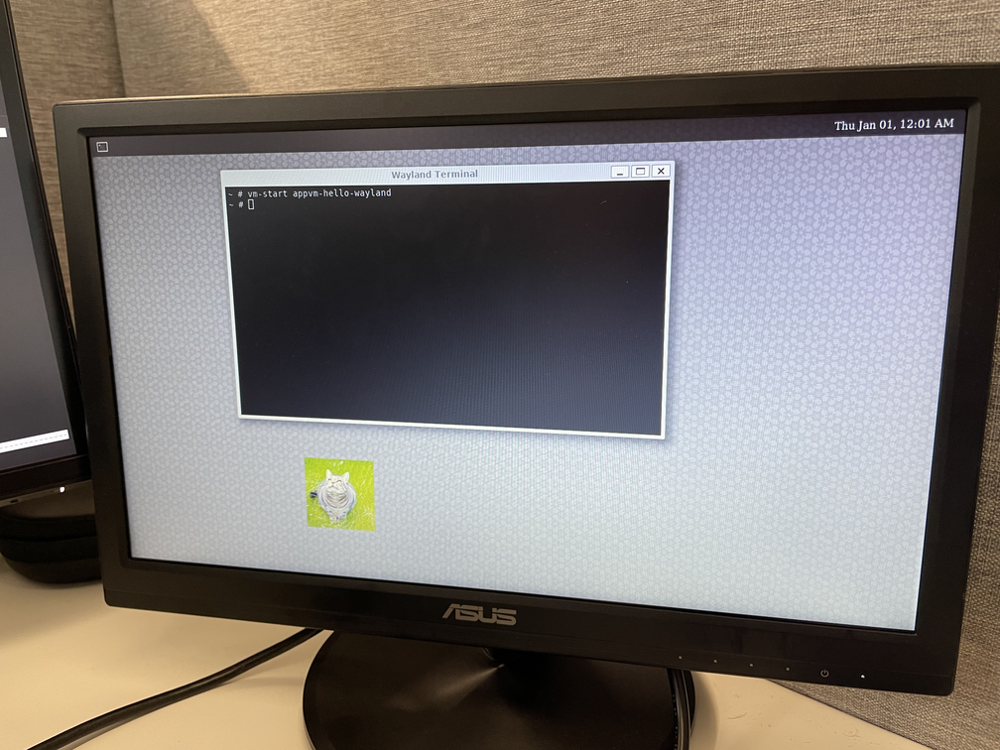

# Spectrum build configs for NXP i.MX8

## Status

Basic structure for out-of-tree build configuration. Wayland graphics VM with GUI app in guest to wayland compositor on host works on iMX8 QM configuration.

Works only on native aarch64 compilation. Does not cross-compile.

## Usage with Spectrum upstream

### Setup repositories

    git clone -b wayland https://github.com/tiiuae/spectrum.git
    git clone -b wayland https://github.com/tiiuae/nixpkgs-spectrum.git
    git clone https://github.com/tiiuae/spectrum-config-imx8

### Build image

    nix-build spectrum-config-imx8/imx8qm/ -I nixpkgs=nixpkgs-spectrum/ -I spectrum-config=spectrum-config-imx8/config.nix

### Test results


1. Build the image on the ARM server
```
❯ ssh awsarm
...
Last login: Thu Oct 27 11:22:16 2022 from 109.240.15.171
~$ mkdir wayland
~$ cd wayland
~/wayland$ git clone -b wayland https://github.com/tiiuae/spectrum.git
Cloning into 'spectrum'...
remote: Enumerating objects: 3445, done.
remote: Counting objects: 100% (477/477), done.
remote: Compressing objects: 100% (158/158), done.
remote: Total 3445 (delta 348), reused 379 (delta 304), pack-reused 2968
Receiving objects: 100% (3445/3445), 744.08 KiB | 6.64 MiB/s, done.
Resolving deltas: 100% (2011/2011), done.
~/wayland$ git clone -b wayland https://github.com/tiiuae/nixpkgs-spectrum.git
Cloning into 'nixpkgs-spectrum'...
remote: Enumerating objects: 3166472, done.
remote: Counting objects: 100% (131/131), done.
remote: Compressing objects: 100% (71/71), done.
remote: Total 3166472 (delta 72), reused 96 (delta 60), pack-reused 3166341
Receiving objects: 100% (3166472/3166472), 888.26 MiB | 15.39 MiB/s, done.
Resolving deltas: 100% (2318250/2318250), done.
Updating files: 100% (31919/31919), done.
~/wayland$ git clone https://github.com/tiiuae/spectrum-config-imx8
Cloning into 'spectrum-config-imx8'...
remote: Enumerating objects: 67, done.
remote: Counting objects: 100% (67/67), done.
remote: Compressing objects: 100% (44/44), done.
remote: Total 67 (delta 28), reused 50 (delta 16), pack-reused 0
Receiving objects: 100% (67/67), 44.09 KiB | 2.10 MiB/s, done.
Resolving deltas: 100% (28/28), done.

~/wayland$ for i in $(ls); do echo $i && git -C $i log --oneline -1; done
e8649a64618 (HEAD -> wayland, origin/wayland) USB to VM build issues with libudev fixed (#27)
spectrum
fb08211 (HEAD -> wayland, origin/wayland) USB to VM build issues fixed
spectrum-config-imx8
b370902 (HEAD -> main, origin/main, origin/HEAD) Add missing configuration options for linux_imx8 kernel

~/wayland$ nix-build spectrum-config-imx8/imx8qm/ -I nixpkgs=nixpkgs-spectrum/ -I spectrum-config=spectrum-config-imx8/config.nix
/nix/store/qlq59356nbxxzhr0drmqcxnls8s0cbn2-spectrum-live-imx8qm.img-0.1
<logout awsarm>
$ scp awsarm:/nix/store/qlq59356nbxxzhr0drmqcxnls8s0cbn2-spectrum-live-imx8qm.img-0.1 .
$ sudo dd if=qlq59356nbxxzhr0drmqcxnls8s0cbn2-spectrum-live-imx8qm.img-0.1 of=/dev/sdc bs=1M status=progress
$ sudo sync
<remove the SD card>
```
2. Put the SD card to the iMX8 QM board and boot
3. Run app VM with `vm-start appvm-hello-wayland`



## More info

See https://spectrum-os.org/doc/build-configuration.html
